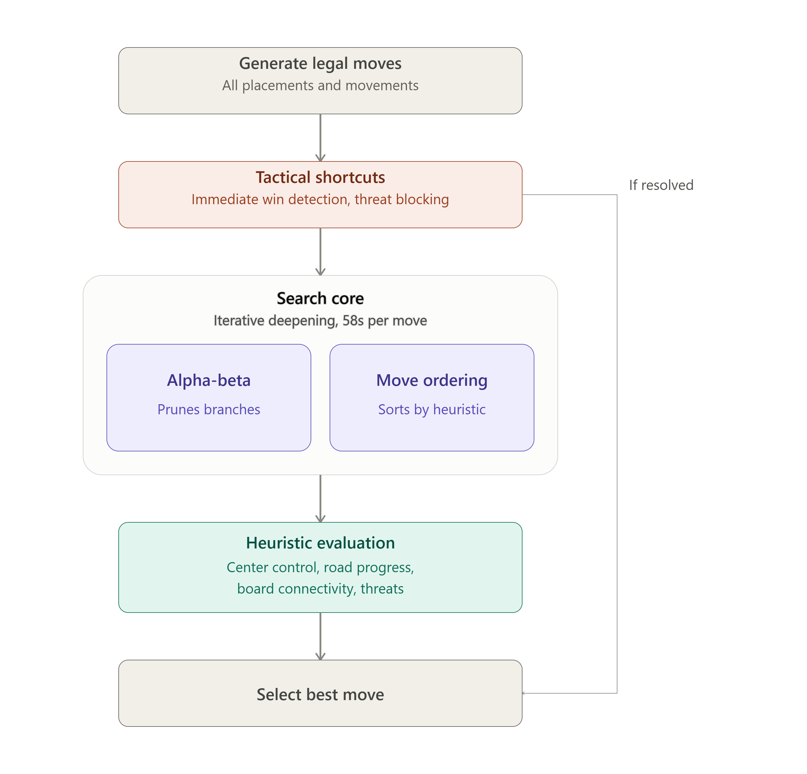

## Project description

This project implements an AI player for the board game Tak.  
The AI is built around Minimax with alpha-beta pruning, iterative deepening, and heuristic-based move ordering to efficiently explore the game tree under a strict time limit.

### Decision process

<p align="center">
  
</p>

### Search algorithm

- Iterative deepening search
- Alpha-beta pruning
- Time-limited computation (58 seconds per move)
- Best move preserved at each completed search depth

### Heuristic evaluation

The evaluation function estimates board positions using multiple strategic factors:

- Control of the center of the board
- Piece type valuation (dolmen, capstone, menhir)
- Path progression toward victory
- Threat detection and blocking
- Material and positional advantage
- Board connectivity and structure formation

### Move generation and ordering

- Generation of all valid placement and movement actions
- Stack movement handling according to game rules
- Move ordering heuristic prioritizing:
  - central control
  - blocking opponent progress
  - strengthening connections
  - reducing inefficient moves

### Tactical improvements

The AI includes several optimizations beyond standard Minimax:

- Immediate win detection (bypassing search when possible)
- Immediate threat blocking
- Opening strategy with corner occupation
- Move filtering and prioritization of critical actions

---

## Project structure

The following two files were added as part of this project:

### BoardHelper.java

Helper subclass of `Board.java` used to access certain private methods of the `Board` class.

File: [BoardHelper.java](https://github.com/hugo-jaumotte/Minimax-algorithm-TAK-game/blob/main/src/main/java/be/belegkarnil/game/board/tak/BoardHelper.java)

---

### hjaumotte.java

Implements the AI strategy based on a Minimax algorithm with alpha-beta pruning, heuristic evaluation, and move ordering to improve pruning efficiency.

File: [hjaumotte.java](https://github.com/hugo-jaumotte/Minimax-algorithm-TAK-game/blob/main/src/main/java/be/belegkarnil/game/board/tak/strategy/hjaumotte.java)

---

## Run the project

1. Clone the repository
  ```bash
git clone https://github.com/hugo-jaumotte/Minimax-algorithm-TAK-game.git
cd Minimax-algorithm-TAK-game
  ```
2. Open the project in IntelliJ IDEA (recommended)
3. Run the main class ([BelegTak.java](https://github.com/hugo-jaumotte/Minimax-algorithm-TAK-game/blob/main/src/main/java/be/belegkarnil/game/board/tak/BelegTak.java))

---

## Origin of the project

This project is based on a Tak game engine codebase provided by the professor as part of the course.

Original repository: [`BoardHelper.java`](src/main/java/be/belegkarnil/game/board/tak/BoardHelper.java)<br>
Original documentation: https://belegkarnil.github.io/BelegTak/framed.html  
Original author: [`Belegkarnil`](https://github.com/belegkarnil)  
License: MIT

The original code was used as a starting point and has been modified and extended.
